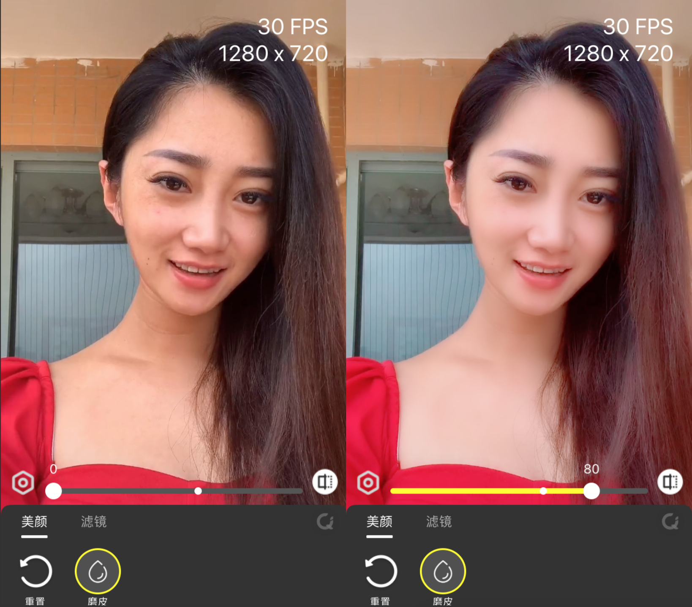
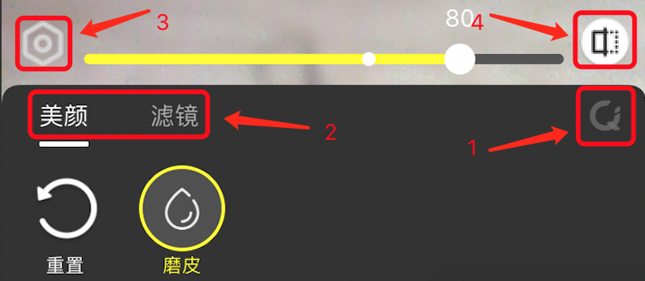
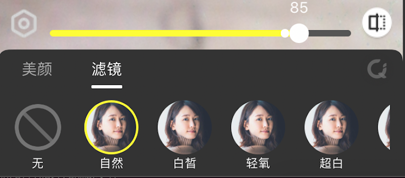
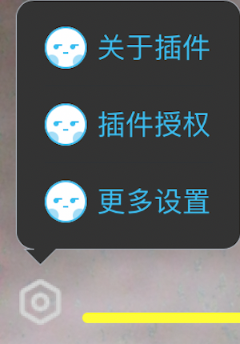
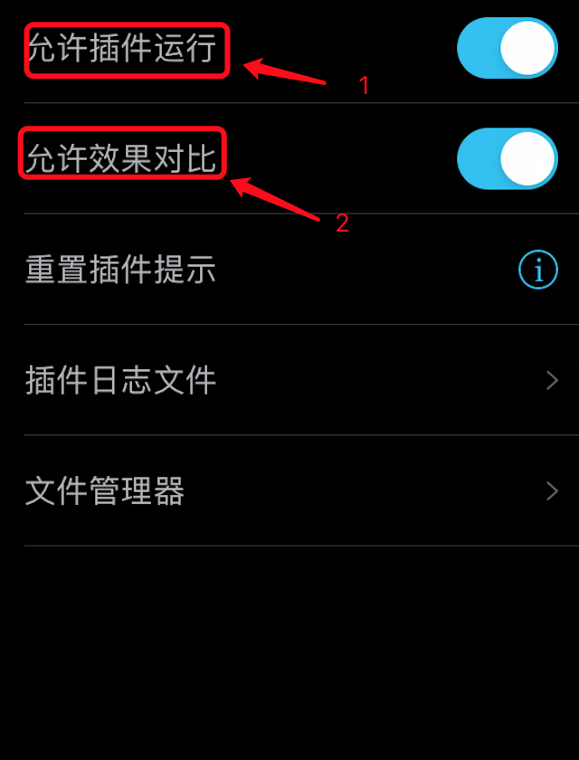

# 地表最强之直播美颜篇

本文出处: https://github.com/finalstreamer/LFU-Stuff/blob/main/LFU-Stuff.md

## 目录

- [背景](#背景)
- [支持App](#支持App)
- [如何安装](#如何安装)
- [如何使用](#如何使用)
- [关于付费](#关于付费)
- [写在最后](#写在最后)
- [参考资料](#参考资料)

## 背景
作为颜值主播，加入各大直播平台的时候，不得不妥协所在直播平台的美颜效果。有些平台手机直播效果比较好，比如抖音，快手等，但大部分平台的效果只能说还凑合。</br>
当我兼职做直播的时候，群里的颜值小姐姐们就经常问起有没有一种厉害的方案，让她们可以自由选择她们想要的美颜效果呢？</br>
以前觉得是不可能的事情，但最近在网络上搜到一个解决方案--北极虾美颜[LFUKit](https://github.com/livefaceu/LFUKit)，并体验演示例子 [LFUKitDemo](https://github.com/livefaceu/LFUKitDemo)，瞬间感觉如获至宝，这个东西老神奇了。据作者说，北极虾美颜本来是给国外软件写的美颜SDK(软件开发包)，真正媲美“某音”效果。然后作者觉得还不错，就把它开放出来，免费供所有人开发和使用。推测这个SDK不仅可以直播使用，视频电话应该也可以使用。</br>

我们先来看下效果图
<div align="center">
 
</div>

效果图的原图是从抖音账户(ID: 7114253)参加的"关掉美颜，关掉滤镜..."作品里截取的第196帧图像。该视频当前有91.6W的点赞，应该挺多人看过。截取的图像通过技术手段放到 [LFUKitDemo] ，屏蔽掉所有的美颜特效，就是左边的样子。然后设置磨皮值80，选取自然滤镜，并且滤镜值80，就可以获得右边的效果。怎么样，效果有没有抖音的感觉。</br>
</br>
北极虾美颜只是SDK，是无法直接使用的，需要有懂开发童鞋把它集成到对应App。Google搜了下，当前有个项目已经支持了Now直播App，项目叫 [NowX](https://github.com/samplebuffer/NowX) 。项目开发者提供了集成思路和部分代码，并声称核心代码其实很简单，一百多行。那不是说，以后别的App集成难度也不大。</br>

## 支持App
当前搜集到的支持北极虾美颜的App

### Now直播
项目名：NowX </br>
项目地址：https://github.com/samplebuffer/NowX </br>
当前版本：Now直播版本 1.56.1.143 </br>
ipa安装包[github]：https://github.com/samplebuffer/NowX/releases/download/v1.56.1.143/NOW-1.56.1.143-lfu-unsigned.ipa </br>
ipa安装包[百度网盘]：详见文章后面百度网盘链接 </br>

### 后续持续补充

## 如何安装
由于苹果的机制，IPA 安装实际包含两个步骤：「签名IPA+安装IPA」。也就是说，在你实际安装之前，安装包必须先签名获得苹果的认证才能安装。有些工具可以同时实现两个步骤「签名IPA+安装IPA」，有些只能实现「安装IPA」，我们根据工具包含的功能分类。分成「签名IPA+安装IPA一体化」和「单纯安装IPA」两种方式。</br>
推荐安装方式：如果你刚开始只是想测试一下美颜功能，可以先使用「签名IPA+安装IPA一体化」-「爱思助手」安装过渡一下。一旦你决定长期使用，可以更换到「AltStore」或者 「iMazing」安装。需要注意的是，使用「AltStore」和「iMazing」安装前，最好卸载爱思助手，避免软件冲突。</br>

### 签名IPA+安装IPA一体化
签名 IPA 其实本身比较复杂，一般用户很难理解。另外大部分的签名都是需要付费的，普通用户接受度不高，所以我们重点介绍免费的方式。</br>
当前教程包含「AltStore」和「爱思助手」两种方式，这两者都是免费的。</br>
如果同时满足这两个条件：</br>
手机端：iOS 12.2+</br>
电脑端：Windows 10+ 或者 MacOS 10.14.4+</br>
可以选择「AltStore」方式，否则选「爱思助手」方式。</br>
另外，如果「AltStore」操作的过程中遇到异常无法解决，也可以回退到「爱思助手」方式。个人觉得「AltStore」内部包含了自动续签的机制，相对比「爱思助手」手动机制还是更好些。</br>

#### AltStore
根据文章底部的参考资料《基于AltStore的自签教程》进行安装操作。首次安装的时候，会稍微复杂一点，后面操作就很简单了。里面的教程提供了大量的安装截图，还提供了安装包，其实并不复杂。有点耐心的话，十分钟应该就可以搞定了。</br>
需要注意的是，安装你的 IPA 时，你唯一需要做的就是把你 App 的 IPA 安装包，替换掉教程里的「unc0ver」即可，比如把 Now直播的 IPA 安装包(NOW-1.56.1.143-lfu-unsigned.ipa)替换掉「unc0ver」。</br>

#### 爱思助手
使用「爱思助手」安装时，和《基于AltStore的自签教程》一样，强烈建议重新注册一个新的Apple ID。</br>
```
创建新的Apple ID
很多人的苹果Apple ID已经绑定了大量的信息，包括支付，登陆，浏览等信息。所以，为了安全起见，在你打算安装一个不是从苹果官方商店下载的软件前，强烈建议你重新创建一个新的Apple ID，创建是完全免费的，创建过程也是非常简单的。
创建帮助文档地址：https://support.apple.com/zh-cn/HT204316
地址里的帮助文档，已经非常详细了。这里不多做介绍。注意，创建的过程中，绝对不需要绑定任何支付信息等，也建议使用一个新的密码。
```
</br>
然后下载「爱思助手」，下载地址： https://www.i4.cn/pro_pc.html </br>
</br>
最后根据文章底部的参考资料《爱思助手IPA签名教程》中 "使用 Apple ID 签名" 章节进行签名操作，再根据文章底部的参考资料《爱思助手安装ipa文件教程》进行安装操作。</br>
这种安装模式有个明显缺点，签名的有效期为7天，7天过后，你需要再重新安装一次。怎么知道是不是到期了呢？当你点击手机上你的APP，APP 马上闪退，无法启动，说明就是到期了。</br>

### 单纯安装IPA
在安装 IPA 之前，实际上还是需要证书签名 IPA 的，只是大部分的时候，证书签名这个操作是你付费让别人帮你做了。</br>
证书签名一般需要使用到付费的苹果开发者证书，个人仅仅为了安装一个软件，需要付费差不多1000+，那就太不划算了，所以有些淘宝店主就购买证书然后分销，每次大概30~60元一次。付费后淘宝的店家就会给你提供的 IPA 签名，签名后再把 IPA 发回给你，你自己再安装到手机。付费的好处是一旦安装上，根据情况在一年内都能使用。但实际操作中，很多 App 三四个月就提示版本过旧，强制你升级，导致你需要不断付费签名，一年累积下来，还是比较贵的。另外还需要跟店主沟通和等待处理，不够灵活和及时。</br>
实际操作中，你需要到淘宝搜索 "ipa签名安装"等类似关键字，咨询店主购买相关签名服务，购买服务过程中，你需要把你 App 的 IPA 安装包或者 IPA 安装包链接发给店家，比如提供 Now直播的 IPA 安装包(NOW-1.56.1.143-lfu-unsigned.ipa) 链接。然后要求店家签名必须保持默认的 BundleID，因为改动 BundleID 比较容易被应用检测，App公司所的服务器可能拒绝服务。可能你这段看不太懂，没关系，你只要把这段复制黏贴给商家，他们懂的</br>
</br>
安装方式也有两种，但是因为中国软件比较流氓，我更喜欢用 iMazing。</br>

#### iMazing
根据文章底部的参考资料《基于iMazing的IPA安装教程》进行安装操作。 </br>

#### 爱思助手
根据文章底部的参考资料《爱思助手安装ipa文件教程》进行安装操作。</br>

## 如何使用
北极虾美颜的操作界面也比较简单，核心就是一个控制面板，它悬浮在所有窗口上面。下面列出主要功能的截图。</br>

「美颜控制面板」: 1:「美颜面板开关」 2:「菜单」 3:「设置」 4:「对比」</br>
当你第一次打开直播预览的时候，「美颜面板开关」会首次弹出，点击即可进入「美颜面板」，期间，程序提供了几个重要按钮的提示条，按顺序认真看完即可马上上手。</br>
<div align="center">
 
</div>
</br>
<div align="center">
 
</div>

</br>
「菜单」</br>
<div align="center">
 
</div>

</br>
「菜单」-「关于插件」主要介绍作者的联系方式，也可以到 https://github.com/livefaceu/LFUKit 查看。</br>

</br>
「菜单」-「插件授权」</br>
<div align="center">
 
</div>

</br>
「菜单」-「更多设置」</br>
<div align="center">
 
</div>

</br>
</br>
每个App使用北极虾美颜还可能有一些区别，下面，我们对每个App单独列出来说明。</br>

### Now直播
#### 应用不能同时共存
如果你想使用集成北极虾美颜的插件版Now直播，你最好把从苹果商店下载的Now直播先删除。原因是Now直播使用第三方登陆(QQ或微信)，由于登陆的特殊机制，不删除旧的话，新安装的插件版Now直播就无法登陆。</br>

#### 美颜效果优先级
在调整美颜效果时，北极虾美颜比原App美颜拥有更高优先级。也就是说，</br>
当切换到北极虾美颜时，北极虾美颜「存在的美颜选项」效果将会覆盖原App美颜对应选项效果，但原App美颜剩余选项(北极虾美颜「不存在的美颜选项」)的效果将不受影响。</br>
当切换到原App美颜时，北极虾美颜效果将会屏蔽，原App美颜效果将恢复。</br>
比如：</br>
当切换到北极虾美颜模式时，磨皮值和滤镜由北极虾美颜控制的，而在Now原美颜控制面板里，选择磨皮和滤镜，滑动是没有变化的，而选择瘦脸，滑动却是有变化的。</br>
当切换到Now原美颜模式时，北极虾美颜效果将消失，所有的美颜效果将根据Now原美颜控制面板里的选择进行恢复。</br>

## 关于付费
北极虾美颜SDK是免费开源的，任何人都可以使用。</br>
基础版：不需要注册，再结合上面免费的安装方式，其实是完全免费的，已经算良心了。唯一的限制就是，美颜效果会根据时间循环切换：切换到北极虾美颜(10分钟)->切换到原App美颜(5分钟)->切换到北极虾美颜(10分钟)....但是当切换到北极虾美颜时，效果跟专业版是一致的。</br>
专业版：需要到「插件授权」申请授权，另外可以到「菜单」-「关于插件」找到作者的联系方式进行咨询。</br>
</br>
总之，一般主播可以使用免费的基础版，效果也是有大幅提升的，如果需要更好的直播品质，建议购买专业版。</br>

## 写在最后
因为 Github 是国外网站，访问可能容易异常，图片无法显示，下载像蚂蚁。我把所有相关资料，包括AltStore安装教程，免费安装方式所需的安装包，本篇文章，还有所有支持的App都集中放到百度网盘里，方便大家下载。链接如下：</br>
链接: https://pan.baidu.com/s/1Y7eR2V958YJWrzWclSs7ag 提取码: 6j8n </br>
</br>
最后不得不说得是，难得有开发者提供一个免费的，商业化的，高品质的美颜SDK，并且这个SDK可以轻而易举的集成到任何一个视频直播，视频聊天软件。希望互联网的大神们能看到它，集成到更多的App里，供大家使用。如果有任何问题，欢迎编写邮件发送至 <finalStreamer@gmail.com>，一起探讨。</br>

## 参考资料
* 基于AltStore的自签教程: https://github.com/livefaceu/AltStore-HowTo/blob/main/AltStore-HowTo.md
* 基于iMazing的IPA安装教程: https://github.com/finalstreamer/iMazing-Howto.git
* 爱思助手IPA签名教程: http://pc.i4.cn/news_detail_38195.html
* 爱思助手安装ipa文件教程: http://pc.i4.cn/news_detail_3339.html
* LFUKit: https://github.com/livefaceu/LFUKit
* LFUKit-Demo: https://github.com/livefaceu/LFUKitDemo
* NWAKit: https://github.com/samplebuffer/NWAKit
* NowX: https://github.com/samplebuffer/NowX
