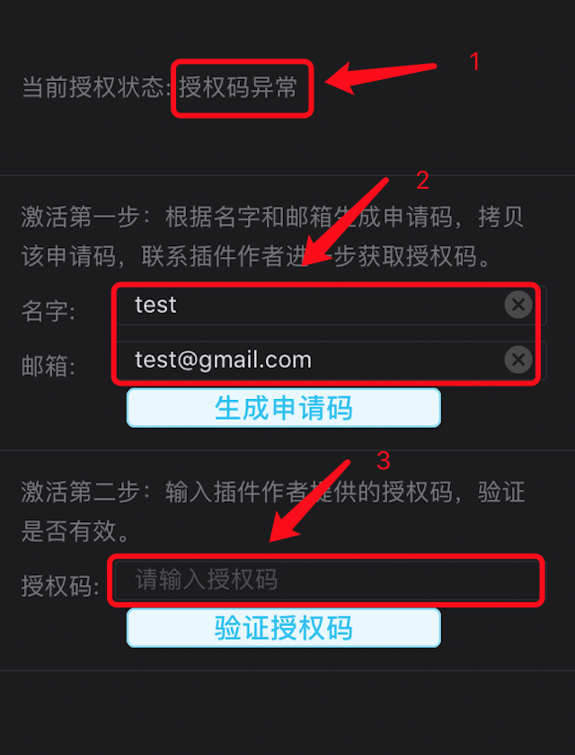

# 地表最强之直播美颜篇

本文出处: https://github.com/finalstreamer/LFU-Stuff/blob/main/LFU-Stuff.md

## 目录

- [背景](#背景)
- [支持App](#支持App)
- [如何安装](#如何安装)
- [如何使用](#如何使用)
- [关于付费](#关于付费)
- [写在最后](#写在最后)
- [参考资料](#参考资料)

## 背景
作为颜值主播，加入各大直播平台的时候，不得不妥协所在直播平台的美颜效果。有些平台手机直播效果比较好，比如抖音，快手等，但大部分平台的效果只能说还凑合。 
当我兼职做直播的时候，群里的颜值小姐姐们就经常问起有没有一种厉害的方案，让她们可以自由选择她们想要的美颜效果呢？ 
以前觉得是不可能的事情，但最近在网络上搜到一个解决方案--北极虾美颜[LFUKit](https://github.com/livefaceu/LFUKit)，并体验演示例子 [LFUKitDemo](https://github.com/livefaceu/LFUKitDemo)，瞬间感觉如获至宝，这个东西老神奇了。据作者说，北极虾美颜本来是给国外软件写的美颜SDK(软件开发包)，真正媲美“某音”效果。然后作者觉得还不错，就把它开放出来，免费供所有人开发和使用。推测这个SDK不仅可以直播使用，视频电话应该也可以使用。 

我们先来看下效果图

 

效果图的原图是从抖音账户(ID: 7114253)参加的"关掉美颜，关掉滤镜..."作品里截取的第196帧图像。该视频当前有91.6W的点赞，应该挺多人看过。截取的图像通过技术手段放到 [LFUKitDemo] ，屏蔽掉所有的美颜特效，就是左边的样子。然后设置磨皮值80，选取自然滤镜，并且滤镜值80，就可以获得右边的效果。怎么样，效果有没有抖音的感觉。 
 
北极虾美颜只是SDK，是无法直接使用的，需要有懂开发童鞋把它集成到对应App。Google搜了下，当前有个项目已经支持了Now直播App，项目叫 [NowX](https://github.com/samplebuffer/NowX) 。项目开发者提供了集成思路和部分代码，并声称核心代码其实很简单，一百多行。那不是说，以后别的App集成难度也不大。 

## 支持App
当前搜集到的支持北极虾美颜的App

### Now直播
项目名：NowX  
项目地址：https://github.com/samplebuffer/NowX  
当前版本：Now直播版本 1.56.1.143  
ipa安装包[github]：https://github.com/samplebuffer/NowX/releases/download/v1.56.1.143/NOW-1.56.1.143-lfu-unsigned.ipa  
ipa安装包[百度网盘]：详见文章后面百度网盘链接  

### 后续持续补充

## 如何安装
安装方式有两种： 
免费安装方式：《基于AltStore的自签教程》，详见文章后面百度网盘链接。  
付费安装方式：淘宝搜宝贝关键字 "ipa签名安装"，咨询相关店主。  

### 免费安装方式
需要满足这两个条件： 
手机端：iOS 12.2+ 
电脑端：Windows 10+ 或者 MacOS 10.14.4+ 
免费安装方式第一次安装的时候，会稍微复杂一点，但是上面的教程提供了大量的安装截图，有点耐心的话，十分钟应该就可以搞定了。一旦第一次安装后，按照要求，就可以持续使用。另外免费安装方案比付费安装有更好的灵活性，一旦大神们提供最新的支持北极虾美颜的安装包，就可以自己去下载和安装，不用求人。 
 
需要注意的是，当你按照《基于AltStore的自签教程》里的详细步骤操作时，唯一需要的就是把你App的ipa安装包，替换掉教程里的「unc0ver」即可。例如： 
把 Now直播的ipa安装包(NOW-1.56.1.143-lfu-unsigned.ipa)替换掉「unc0ver」 

### 付费安装方式
付费安装方式一般需要使用到付费的苹果的开发者证书，个人仅仅为了安装一个软件，需要付费差不多1000+，那就太不划算了，所以有些淘宝店主就购买证书分销。付费后淘宝的店家就会给你的软件签名，才能实际安装到手机，大概30~60一次。付费的好处是一旦安装上，根据情况在一年内都能使用。但实际操作中，很多App三四个月就提示版本过旧，强制你升级，导致你需要不断付费签名，一年累积下来，还是比较贵的。另外还需要跟店主沟通和等待处理，不够灵活和及时。 
 
需要注意的是，你需要把你App的ipa安装包或者ipa安装包链接发给店主，例如，提供 Now直播的ipa安装包(NOW-1.56.1.143-lfu-unsigned.ipa) 。 
然后要求它签名的时候保持默认的BundleID，因为改动BundleID比较容易被应用检测，然后App服务器可能拒绝服务。 

### 安装结论
不差钱的使用付费安装方式，有点动手能力的使用免费安装方式，自由选择。 

## 如何使用
北极虾美颜的操作界面也比较简单，核心就是一个控制面板，它悬浮在所有窗口上面。下面列出主要功能的截图。 

「美颜控制面板」: 1:「美颜面板开关」 2:「菜单」 3:「设置」 4:「对比」 
当你第一次打开直播预览的时候，「美颜面板开关」会首次弹出，点击即可进入「美颜面板」，期间，程序提供了几个重要按钮的提示条，按顺序认真看完即可马上上手。 

 

 

 

 
「菜单」 

 

 
「菜单」-「关于插件」主要介绍作者的联系方式，也可以到 https://github.com/livefaceu/LFUKit 查看。 

 
「菜单」-「插件授权」 

 

 
「菜单」-「更多设置」 

 

 
 
每个App使用北极虾美颜还可能有一些区别，下面，我们对每个App单独列出来说明。 

### Now直播
#### 应用不能同时共存
如果你想使用集成北极虾美颜的插件版Now直播，你最好把从苹果商店下载的Now直播先删除。原因是Now直播使用第三方登陆(QQ或微信)，由于登陆的特殊机制，不删除旧的话，新安装的插件版Now直播就无法登陆。 

#### 美颜效果优先级
在调整美颜效果时，北极虾美颜比原App美颜拥有更高优先级。也就是说， 
当切换到北极虾美颜时，北极虾美颜「存在的美颜选项」效果将会覆盖原App美颜对应选项效果，但原App美颜剩余选项(北极虾美颜「不存在的美颜选项」)的效果将不受影响。 
当切换到原App美颜时，北极虾美颜效果将会屏蔽，原App美颜效果将恢复。 
比如： 
当切换到北极虾美颜模式时，磨皮值和滤镜由北极虾美颜控制的，而在Now原美颜控制面板里，选择磨皮和滤镜，滑动是没有变化的，而选择瘦脸，滑动却是有变化的。 
当切换到Now原美颜模式时，北极虾美颜效果将消失，所有的美颜效果将根据Now原美颜控制面板里的选择进行恢复。 

## 关于付费
北极虾美颜SDK是免费开源的，任何人都可以使用。 
基础版：不需要注册，再结合上面免费的安装方式，其实是完全免费的，已经算良心了。唯一的限制就是，美颜效果会根据时间循环切换：切换到北极虾美颜(10分钟)->切换到原App美颜(5分钟)->切换到北极虾美颜(10分钟)....但是当切换到北极虾美颜时，效果跟专业版是一致的。 
专业版：需要到「插件授权」申请授权，另外可以到「菜单」-「关于插件」找到作者的联系方式进行咨询。 
 
总之，一般主播可以使用免费的基础版，效果也是有大幅提升的，如果需要更好的直播品质，建议购买专业版。 

## 写在最后
因为 Github 是国外网站，访问可能容易异常，图片无法显示，下载像蚂蚁。我把所有相关资料，包括AltStore安装教程，免费安装方式所需的安装包，本篇文章，还有所有支持的App都集中放到百度网盘里，方便大家下载。链接如下： 
链接: https://pan.baidu.com/s/1Y7eR2V958YJWrzWclSs7ag 提取码: 6j8n  
 
最后不得不说得是，难得有开发者提供一个免费的，商业化的，高品质的美颜SDK，并且这个SDK可以轻而易举的集成到任何一个视频直播，视频聊天软件。希望互联网的大神们能看到它，集成到更多的App里，供大家使用。如果有任何问题，欢迎编写邮件发送至 <finalStreamer@gmail.com>，一起探讨。 

## 参考资料
* 基于AltStore的自签教程: https://github.com/livefaceu/AltStore-HowTo/blob/main/AltStore-HowTo.md
* LFUKit: https://github.com/livefaceu/LFUKit
* LFUKit-Demo: https://github.com/livefaceu/LFUKitDemo
* NWAKit: https://github.com/samplebuffer/NWAKit
* NowX: https://github.com/samplebuffer/NowX
